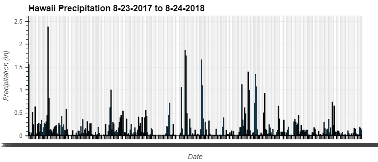
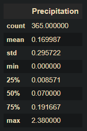

# SQLAlchemy Challenge

Hawaii Climate Analysis

In this challenge, the following skills are applied:  

* Use SQLAlchemy create_engine to connect to the SQLite database  
* Use SQLAlchemy automap_base() to reflect the tables into classes and save the classes to variables  
* Link Python to the database by creating an SQLAlchemy session  

###Precipitation Analysis

* Find the most recent date in the data set  
* Retrieve last 12 months of data from the most recent date  
* Load query results into Pandas dataframe and set the index to the date column  
* Sort the dataframe values by date  
* Plot the results  
* Print the summary statistics for the precipitation data  

