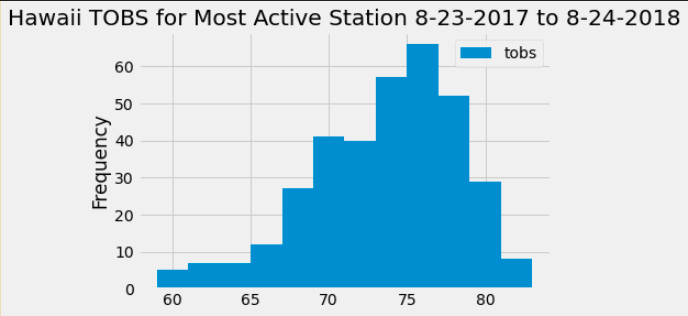

# SQLAlchemy Challenge

## Hawaii Climate Analysis

In this challenge, the following skills are applied:  

* Use SQLAlchemy create_engine to connect to the SQLite database  
* Use SQLAlchemy automap_base() to reflect the tables into classes and save the classes to variables  
* Link Python to the database by creating an SQLAlchemy session  

### *Precipitation Analysis*

* Find the most recent date in the data set  
* Retrieve last 12 months of data from the most recent date  
* Load query results into Pandas dataframe and set the index to the date column  
* Sort the dataframe values by date  
* Plot the results  
* Print the summary statistics for the precipitation data  

### *Station Analysis*

* Calculate the total number of stations in the dataset using a query  
* Find the most active stations using a query  
* Calculate the lowest, highest, and average temperature for the most active station  
* Use a query to retrieve the last 12 months of temperature observation data (TOBs)  
* Filter by the station with the highest number of observations  
* Query the last 12 months of temperature observation data for this station  
* Plot in a histogram using bins = 12  

### *Climate App*

* Use Flask API to create routes: Home page that lists all routes  
* Convert query results to a dictionary and return a JSON representation through the API  
* Return a JSON list of stations data  
* Query the dates and temperature observations of the most active station for the last year od data and return a JSON list through the API  
* Return a JSON list of the minimum temperature, the average temperature, and the max temperature for a given start-end date range through the API  
### *Temperature Analysis I*

Hawaii is reputed to enjoy mild weather all year. Is there a meaningful difference between the temperature in, for example, June and December?  

In this analysis we do the following:  
* Compare average temperature of June and December for Hawaii historical data  
* Use a t-test to determine if the difference in means is statistically significant  

### *Temperature Analysis II*

You are looking to take a trip from August first to August seventh of this year, but are worried that the weather will be less than ideal. Using historical data in the dataset find out what the temperature has previously looked like.

In this analysis we do the following:  
* Calculate the min, max, and average temperatures for the last year week that we're planning on going to Hawaii  
* Plot the data using a bar chart  
* Calculate the daily rainfall for the same period and return the data formatted by the weather stations  
* Calculate normal daily temperatures for the week and use an area plot to show the data  